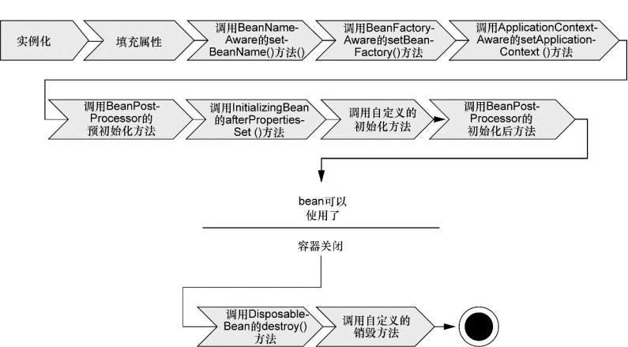
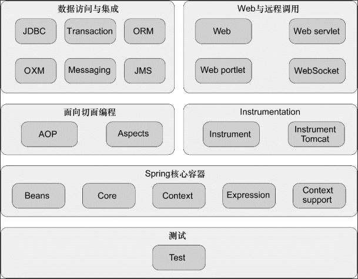
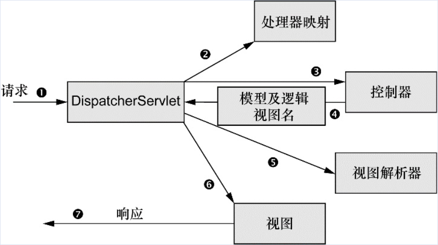

《Spring实战》笔记。

## 第一章 Spring之旅
### 1.1 简化Java开发

为了降低Java开发的复杂性，Spring采取了一下4中关键策略：

  * 基于POJO的轻量级和最小侵入性编程；
  * 基于依赖注入和面向接口实现松耦合；
  * 基于切面和惯例实现声明式编程；
  * 通过切面和模板减少样板式代码。

### 1.2 容纳你的Bean
#### 1.2.1 应用上下文（ApplicationContext）

可能遇到的有：

  * AnnotationConfigApplicationContext： 从一个或多个基于Java的配置类中加载Spring应用上下文。
  * AnnotationConfigWebApplicationContext： 从一个或多个基于Java的配置类中加载Spring Web应用上下文。
  * ClassPathXmlApplicationContext： 从类路径下的一个或多个XML配置文件中加载上下文定义， 把应用上下文的定义文件作为类资源。
  * FileSystemXmlapplicationcontext： 从文件系统下的一个或多个XML配置文件中加载上下文定义。
  * XmlWebApplicationContext： 从Web应用下的一个或多个XML配置文件中加载上下文定义。

#### 1.2.2 bean的生命周期

bean的生命周期如下：

1. Spring对bean进行实例化；
2. Spring将值和bean的引用注入到bean对应的属性中；
3. 如果bean实现了BeanNameAware接口， Spring将bean的ID传递给setBean-Name()方法；
4. 如果bean实现了BeanFactoryAware接口， Spring将调用setBeanFactory()方法， 将BeanFactory容器实例传入；
5. 如果bean实现了ApplicationContextAware接口， Spring将调用setApplicationContext()方法， 将bean所在的应用上下文的引用传入进来；
6. 如果bean实现了BeanPostProcessor接口， Spring将调用它们的postProcessBeforeInitialization()方法；
7. 如果bean实现了InitializingBean接口， Spring将调用它们的after-PropertiesSet()方法。 类似地， 如果bean使用init-method声明了初始化方法， 该方法也会被调用；
8． 如果bean实现了BeanPostProcessor接口， Spring将调用它们的postProcessAfterInitialization()方法；
9． 此时， bean已经准备就绪， 可以被应用程序使用了， 它们将一直驻留在应用上下文中，直到该应用上下文被销毁；
10． 如果bean实现了DisposableBean接口， Spring将调用它的destroy()接口方法。 同样， 如果bean使用destroy-method声明了销毁方法， 该方法也会被调用。

### 1.3 俯瞰Spring风景线
#### 1.3.1 Spring-framework模块

#### 1.3.2 Spring Portfolio

本书会介绍到的除了Spring Framework外，还有Spring Web Flow、Spring Security、Spring Data、Spring Boot。

### 1.4 Spring的新特性
略

## 第二章 装配Bean
### 2.1 Spring配置的可选方案

尽可能地使用自动配置的机制。 显式配置越少越好。 当你必须要显式配置bean的时候（ 比如， 有些源码不是由你来维护的， 而当你需要为这些代码配置bean的时候） ， 我推荐使用类型安全并且比XML更加强大的JavaConfig。 最后， 只有当你想要使用便利的XML命名空间， 并且在JavaConfig中没有同样的实现时， 才应该使用XML。

### 2.2 自动化装配bean

Spring从两个角度来实现自动化装配：
  * 组件扫描（component scanning）： Spring会自动发现应用上下文中所创建的bean。
  * 自动装配（autowiring）： Spring自动满足bean之间的依赖。

具体示例，请见[chapter_2_2](chapter_2_2)

### 2.3 通过Java代码装配bean

有些时候无法完全做到自动化装配，比如要将第三方的库装配到自己的应用的时候。这时候需要用到显示装配。

JavaConfig的方式相对XML来说更加推荐，因为它类型安全、对重构友好。

具体示例，请见[chapter_2_3](chapter_2_3)

### 2.4 通过XML装配bean

使用XML来装配bean的方式相对比较“古老”，新的项目中不建议使用。

具体示例，请见[chapter_2_4](chapter_2_4)

### 2.5 多种配置方式混合

Spring允许自动化装配、JavaConfig、XML配置多种配置方式混合使用，并提供了import机制。

具体示例，请见[chapter_2_5](chapter_2_5)

## 第三章 高级装配
### 3.1 环境与Profile
1）在3.1版本中， Spring引入了bean profile的功能。 要使用profile， 你首先要将所有不同的bean定义整理到一个或多个profile之中， 在将应用部署到每个环境时， 要确保对应的profile处于激活（ active） 的状态。

  * 在JavaConfig中，使用`@Profile`注解来指定某个bean属于哪个profile，注解可以是类级别的，也可以是方法级别的；
  * 在XML中，可以通过`<beans>`元素的`profile`属性来定义其内的bean属于哪个profile。

2）Profile的激活：

Spring在确定哪个profile处于激活状态时， 需要依赖两个独立的属性： spring.profiles.active和spring.profiles.default。 如果设置了spring.profiles.active属性的话， 那么它的值就会用来确定哪个profile是激活的。 但如果没有设置spring.profiles.active属性的话， 那Spring将会查找spring.profiles.default的值。 如果spring.profiles.active和spring.profiles.default均没有设置的话， 那就没有激活的profile， 因此只会创建那些没有定义在profile中的bean。

有多种方式来设置这两个属性：
  * 作为DispatcherServlet的初始化参数；
  * 作为Web应用的上下文参数；
  * 作为JNDI条目；
  * 作为环境变量；
  * 作为JVM的系统属性；
  * 在集成测试类上， 使用@ActiveProfiles注解设置。

3）测试中指定Profile

Spring提供了`@ActiveProfiles("dev")`注解， 我们可以使用它来指定运行测试时要激活哪个profile。 

### 3.2 条件化的bean

Spring 4引入了一个新的@Conditional注解， 它可以用到带有@Bean注解的方法上。 如果给定的条件计算结果为true， 就会创建这个bean， 否则的话， 这个bean会被忽略。

具体示例，请见[chapter_3_2](chapter_3_2)

### 3.3 处理自动装配的歧义性

Autowire默认是基于类型匹配的，仅有一个bean匹配所需的结果时， 自动装配才是有效的。 如果不仅有一个bean能够匹配结果的话， 这种歧义性会阻碍Spring自动装配属性、 构造器参数或方法参数。

  * 可以使用`@Primary`注解标识优先匹配的bean；
  * 可以使用`@Qualifier`进行限定，具体示例，请见[chapter_3_2](chapter_3_2)

### 3.4 bean的作用域

在默认情况下， Spring应用上下文中所有bean都是作为以单例（ singleton） 的形式创建的。 也就是说， 不管给定的一个bean被注入到其他bean多少次， 每次所注入的都是同一个实例。

Spring定义了多种作用域， 可以基于这些作用域创建bean， 包括：
  * 单例（Singleton）： 在整个应用中， 只创建bean的一个实例。
  * 原型（Prototype）： 每次注入或者通过Spring应用上下文获取的时候， 都会创建一个新的bean实例。
  * 会话（Session）： 在Web应用中， 为每个会话创建一个bean实例。
  * 请求（Rquest）： 在Web应用中， 为每个请求创建一个bean实例。

JavaConfig的配置方式，可以通过`@Scope(ConfigurableBeanFactory.SCOPE_PROTOTYPE)`这样的注解定义scope；
XML的配置方式，可以通过在`<bean>`标签中增加`scope`属性来定义，如`<bean id="..." class="..." scope="prototype"/>`。

### 3.5 运行时值注入

Spring提供了两种在运行时求值的方式：
  * 属性占位符（Property placeholder）；
  * Spring表达式语言（SpEL）。

具体示例，请见[chapter_3_5](chapter_3_5)

## 第四章 面向切面的Spring
### 4.1 什么是AOP

描述切面的常用术语有Advice、pointcut、join point、aspect、introduction、weaving。

织入（weaving）是把切面应用到目标对象并创建新的代理对象的过程。 切面在指定的连接点被织入到目标对象中。 在目标对象的生命周期里有多个点可以进行织入：
  * 编译期： 切面在目标类编译时被织入。 这种方式需要特殊的编译器。 AspectJ的织入编译器就是以这种方式织入切面的。
  * 类加载期： 切面在目标类加载到JVM时被织入。 这种方式需要特殊的类加载器（ ClassLoader） ， 它可以在目标类被引入应用之前增强该目标类的字节码。 AspectJ5的加载时织入（ load-time weaving， LTW） 就支持以这种方式织入切面。
  * 运行期： 切面在应用运行的某个时刻被织入。 一般情况下， 在织入切面时， AOP容器会为目标对象动态地创建一个代理对象。 Spring AOP就是以这种方式织入切面的。

Spring对AOP的支持有4种：
  * 基于代理的经典Spring AOP(笨重且复杂，已不推荐使用)；
  * 纯POJO切面（需要XML配置，aop命名空间）；
  * `@AspectJ`注解驱动的切面（Spring基于代理的AOP， 但是编程模型几乎与编写成熟的AspectJ注解切面完全一致。 这种AOP风格的好处在于能够不使用XML来完成功能）；
  * 注入式AspectJ切面（适用于Spring各版本）。

**Spring在运行时应用切面**

直到应用需要被代理的bean时， Spring才创建代理对象。 如果使用的是ApplicationContext的话， 在ApplicationContext从BeanFactory中加载所有bean的时候， Spring才会创建被代理的对象。 因为Spring运行时才创建代理对象， 所以我们不需要特殊的编译器来织入Spring AOP的切面。

**Spring只支持方法级别的连接点**

因为Spring基于动态代理， 所以Spring只支持方法连接点。 这与一些其他的AOP框架是不同的， 例如AspectJ和JBoss， 除了方法切点， 它们还提供了字段和构造器接入点。 Spring缺少对字段连接点的支持， 无法让我们创建细粒度的通知， 例如拦截对象字段的修改。 而且它不支持构造器连接点， 我们就无法在bean创建时应用通知。

但是方法拦截可以满足绝大部分的需求。 如果需要方法拦截之外的连接点拦截功能， 那么我们可以利用Aspect来补充Spring AOP的功能。

### 4.2 通过切点来选择连接点

在Spring AOP中， 要使用AspectJ的切点表达式语言来定义切点。并且Spring仅支持AspectJ切点指示器（pointcut designator）的一个子集。如下：

  * `execution()`，用于匹配连接点的执行方法。只有这个表达式是实际执行匹配的，其他都是用来限制匹配的。
  * `within()`，限制连接点匹配指定的类型。
  * `@within()`，限制连接点匹配指定注解所标注的类型（ 当使用Spring AOP时， 方法定义在由指定的注解所标注的类里）。
  * `arg()`，限制连接点匹配参数为指定类型的执行方法。
  * `@args()`，限制连接点匹配参数由指定注解标注的执行方法。
  * `this()`，限制连接点匹配AOP代理的bean引用为指定类型的类。
  * `target`，限制连接点匹配目标对象为指定类型的类。
  * `@target()`，限制连接点匹配特定的执行对象， 这些对象对应的类要具有指定类型的注解。
  * `@annotation`，限定匹配带有指定注解的连接点。

此外，Spring还增加了一个`bean()`表达式：

  * `bean()`，使用bean ID或bean名称作为参数来限制切点只匹配特定的bean。

如：
  * `execution(* com.getset.bais.aop.concert.Performance.perform(..) && within(com.getset.bais.aop.concert.*))`
  * `execution(* com.getset.bais.aop.concert.Performance.perform(..) && bean('woodlock'))`

### 4.3 使用注解创建切面

  * 使用`@Aspect`注解切面类；
  * 使用`@PointCut`注解生命`被切`的目标方法，需要用到上边的切点表达式；
  * 使用`@Before`、`@After`、`@AfterReturning`、`@AfterThrowing`和`@Around`注解在要织入的方法上；
    * 可以基于`@PointCut`声明的切点或切点表达式声明的切点；
    * 可以使用`args`来声明参数化的Advice；
  * 使用`@EnableAspectAutoProxy`注解配置类，来启用`@Aspect`的自动代理；
  * 使用`@DeclareParents`注解来引入其他接口功能。

### 4.4 在XML中声明切面

使用注解创建切面很方便，但是存在一个明显的不便：当源码不在自己手中的时候，或源码不方便修改的时候，就无法这么做了。这时候需要XML的配置方式发挥作用了。

  * 使用`<aop:aspect>`定义一个切面；
  * 使用`<aop:pointcut>`定义一个切点；
  * 使用`<aop:before>`、`<aop:after>`、`<aop:after-returning>`、`<aop:after-throwing>`、`<aop:around>`定义要织入的方法；
    * 可以注入`<aop:pointcut>`和<args>?
  * 使用`<aop:aspectj-autoproxy>启用`@Aspect`注解驱动的切面；
  * 使用`<aop:declare-parents>`为被advice的对象引入额外的接口；
  * `<aop:config>`是一个顶层AOP配置元素，大多数的`<aop:*>`元素必须包含其内。

以上3节，具体示例，请见[chapter_4_2-4](chapter_4_2-4)

## 第五章 构建Spring Web应用程序

跟踪Spring MVC的请求处理过程，如下图：

1. 请求首先到达一个front controller servlet，前端控制器是web框架常用的Web应用程序模式，这个单例的Servlet（SpringMVC中就是`DispatcherServlet`）将请求委托给应用程序的其他组件来执行。
2. `DispatcherServlet`的任务是将请求分发给相应的`Controller`来处理，前者通过查询`RequestMapping`中的映射关系来确定各种url的请求分别由哪个`Controller`来处理。
3. `DispatcherServlet`将请求发送给`Controller`后，请求中的信息也会交给`Controller`处理。
4. `Controller`处理完成后，可能会需要反馈一些信息给请求方，这些信息以`Model`的形式存在；此外只有数据信息还不够，还需要进行可视化展现，通常用HTML/JSP，这些展现页面叫做`View`。`Controller`将`Model`和`View`名称发回给`DispatcherServlet`。
5. `DispatcherServlet`收到`Model`和`View`名称后，使用视图解析器（view resolver）解析出具体的视图实现，比如JSP。
6. `DispatcherServlet`用定位到的视图结合`Model`中的信息进行渲染。
7. 最终视图渲染后的内容通过响应对象传给客户端。

下面搭建一个简单的SpringMVC的demo来测试，具体请见[chapter_5](chapter_5)。

## 第六章 渲染Web视图

将控制器中请求处理的逻辑和视图中的渲染实现解耦是Spring MVC的一个重要特性。 比如上一章的例子，我们使用了名为InternalResourceViewResolver的视图解析器，将控制器与具体的JSP视图解耦，控制器本身并不关心返回的字符串是个JSP还是HTML还是其他。

（介绍JSP和JSTL的部分略）

### 6.4 使用Thymeleaf

具体示例，请见[chapter_6_4](chapter_6_4)

## 第七章 SpringMVC的高级技术

### 7.2 处理multipart形式的数据

即文件上传。需要如下操作：
1. 在`ServletConfig`中配置multipart解析器`MultipartResolver`，Spring内置了两个`MultipartResolver`：
  * `CommonsMultipartResolver`：使用Jakarta Commons FileUpload 解析multipart请求；
  * `StandardServletMultipartResolver`：Spring 3.1开始增加的解析器，推荐用这个。
2. 上一条配置仅返回一个`StandardServletMultipartResolver`对象，具体配置通过在`DispatcherServletInitializer`中重写`customizeRegistration`方法来配置：
  * 配置中通过`MultipartConfigElement`构造方法参数设置文件上传临时路径、文件大小和整个请求文件大小限制、上传文件达到多大会写入到磁盘上。
3. 处理multipart请求需要做如下处理：
  * `<form>`表单需要指定`enctype`，如`<form method="POST" enctype="multipart/form-data">`；
  * 表单中的input元素要定义为file类型，如`<input type="file" name="picture" accept="image/jpeg,image/png,image/gif">`；
  * 控制器方法中相应的multipart参数用`@RequestPart("name")`注解，如`@RequestPart("picture") MultipartFile picture`。

### 7.3 处理异常

对于异常的处理有两种方式：
  * 在异常类上通过`@ResponseStatus`注解指定返回码和返回信息；
  * 如果想捕获异常并做进一步处理，可以拿出一个专门的控制器方法来处理异常（比如返回错误页面的视图名），这个方法用`@ExceptionHandler`注解指定，对当前控制器内的所有指定异常有效；
  * 如果`@ExceptionHandler`注解指定的方法位于使用`@ControllerAdvice`注解的类中，那么该方法对整个应用程序的注解指定的异常都有效。

### 7.4 为控制器添加通知

7.3最后一条实际上就是利用了控制器通知`@ControllerAdvice`，这样的类可以包含如下几种注解的方法：
  * `@ExceptionHandler`统一处理异常；
  * `@InitBinder`应用到所有@RequestMapping注解方法，在其执行之前初始化数据绑定器；
  * `@ModelAttribute`应用到所有@RequestMapping注解方法，在其执行之前把返回值放入Model。

### 7.5 跨重定向请求传递数据

借助`"redirect:"`可以实现请求的重定向，它的直接好处就是可以防止由于用户点击浏览器的刷新或后退按钮时重复执行请求，通常在POST请求时返回重定向的视图名称。

同时，重定向请求也有个问题，那就是重定向后的请求其模型中的内容会清空，因此如果要在重定向前后的请求中共享数据，可以通过如下两种方式实现：
  * 将信息通过URL传递，比如`return "redirect:spitter/" + spitter.getUsername()`；但是字符串拼接在URL和SQL查询中通常都是存在风险的，Spring提供了占位符的方式来脱去风险，如`return "redirect:spitter/{username}"`，其中`username`用占位符表示，其中的不安全字符会被转义，唯一需要做的就是先将`username`作为attribute放到Model中（未测试OK）；
  * 对于复杂的内容，比如对象信息，就很难通过URL传递了，这时可以先放到session的属性列表中，然后再下次请求取回，并清掉session中的属性。Spring提供了`RedirectAttribute`用于保存重定向的属性，使用`setFlashAttribute`方法设置。

具体示例，请见[chapter_7](chapter_7)
